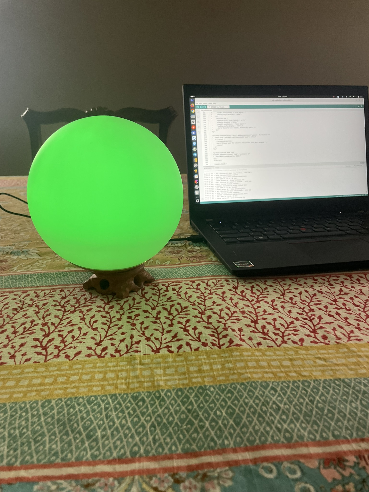
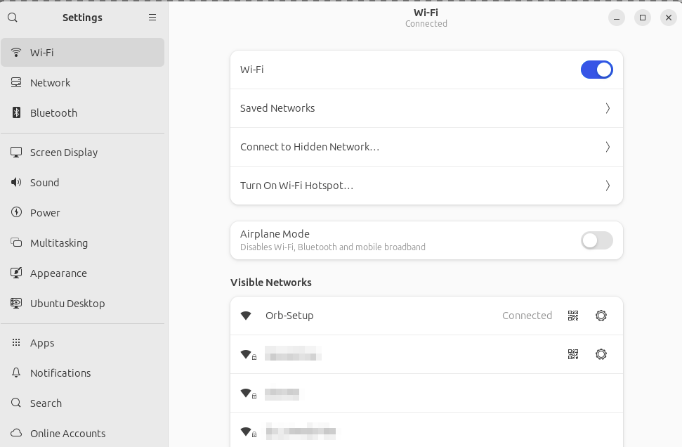
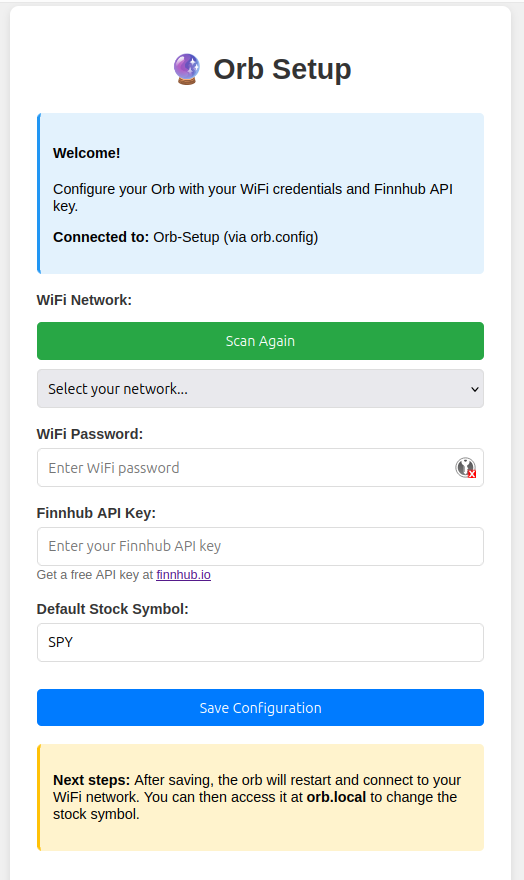
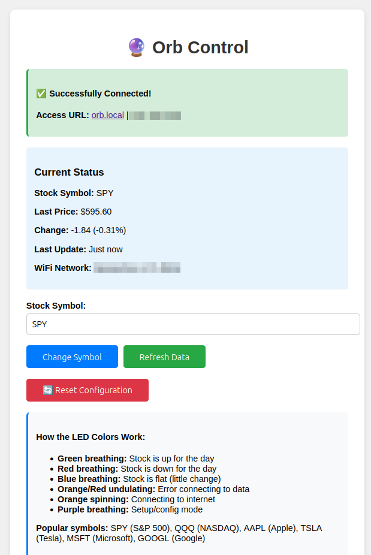
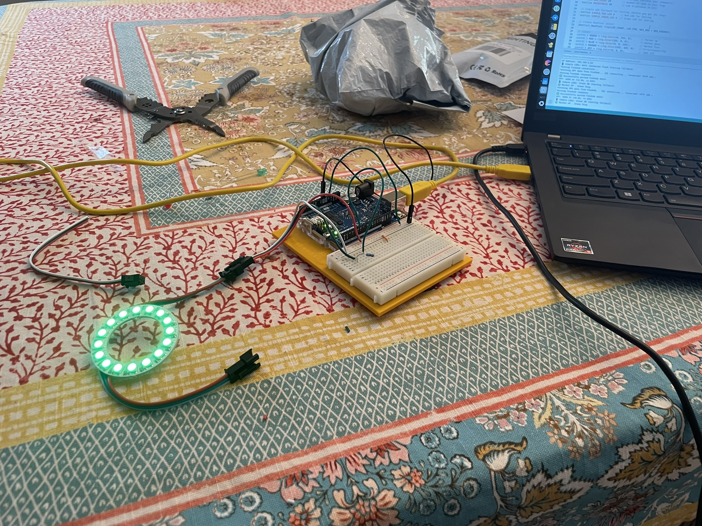
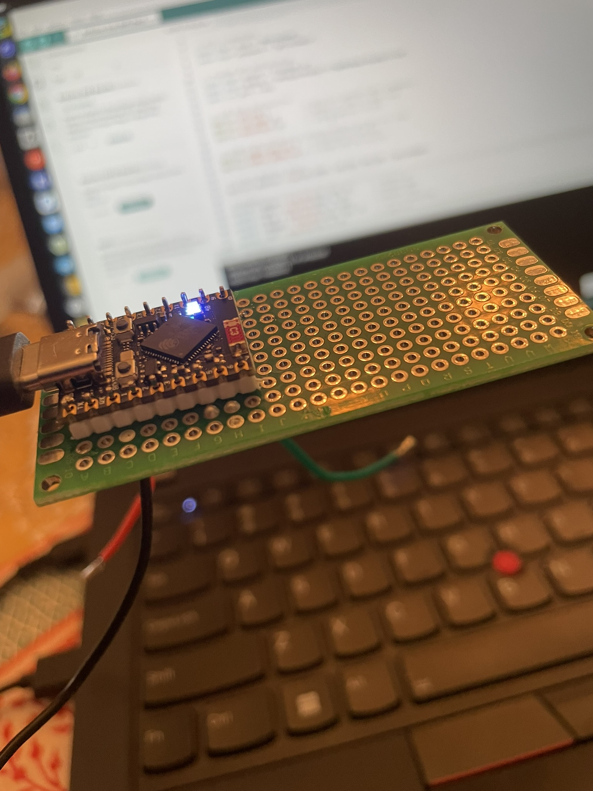
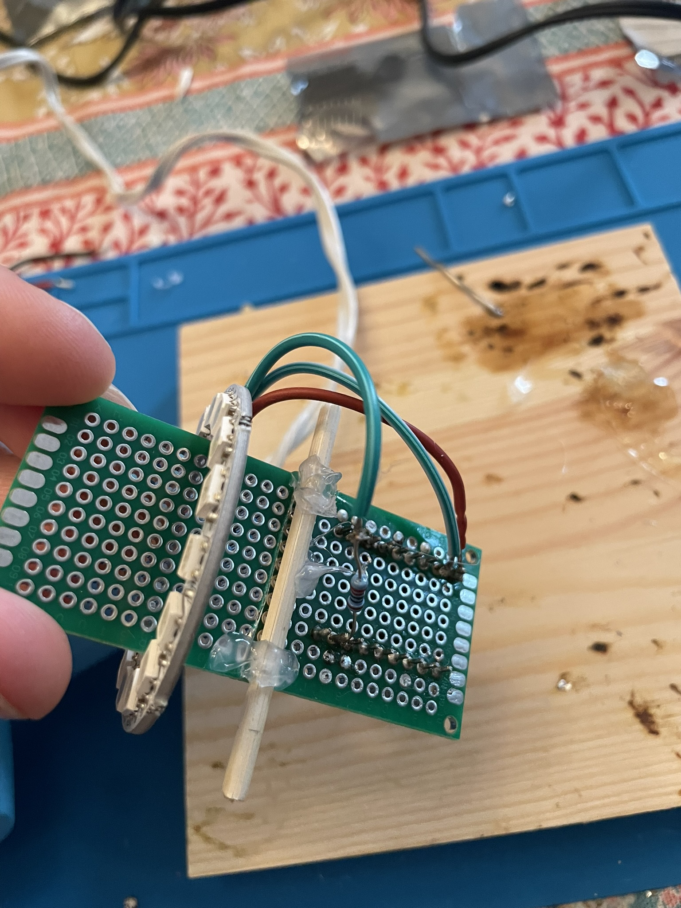
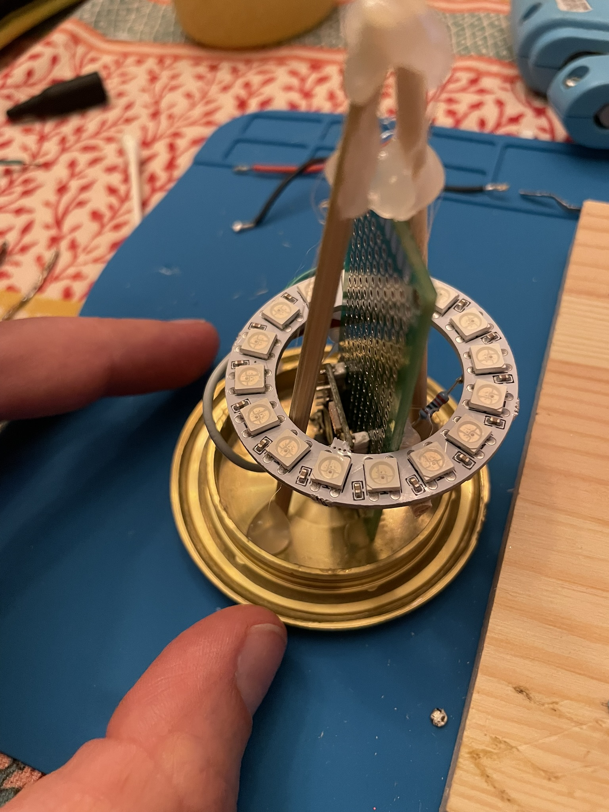
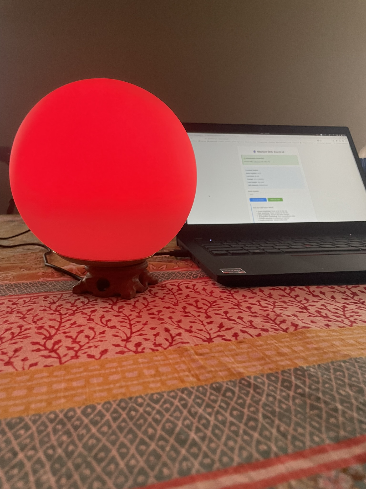

Title: Building a magical stock market orb
Date: 2025-06-20 10:25
Category: General
Tags: 
Slug: building-a-magical-stock-market-orb
Author: Forest Dussault
Summary: I built a glowing orb that monitors the stock market

I built a simple IoT device that glows green when a chosen ticker is up and red when it's down. Think of it as a mood lamp for finance bros. I've had this idea for years 
but only recently overcame the activation energy required to pull it off (largely thanks to LLMs). 

## How the Orb works

The Orb is a configurable device that displays market performance through dynamic ambient lighting.

The user is able to select any ticker via a web UI, and the Orb then retrieves a quote for the ticker. It then responds green for gains, red for losses, or blue for flat performance. 
It's quite satisfying to glance across the room and immediately know how your precious ticker is doing.

The Orb requires USB power and a live WiFi connection. Upon receiving power, the Orb spins up a WiFi network called `Orb-Setup`. 

The user connects to this network, then navigates to `http://orb.config` to input their WiFi information and [Finnhub](https://finnhub.io/) API key.

Once the setup is done, the user switches back to their home network and is able to enjoy their orb. 
If desired, it can be configured further through the local setup page at `http://orb.local`.

## LLMs as Pedagogical Tools

I had essentially zero embedded electronics experience going into this. To approach the project, I used Claude with the 
[Projects feature](https://www.anthropic.com/news/projects) as a learning tool. This was very effective. The LLM helped me:

- Determine what components and tools to buy (ESP32-S3 dev board, WS2812B LED ring, perfboards, etc)
- Select software ([Arduino IDE](https://www.arduino.cc/en/software/), [KiCad](https://www.kicad.org/))
- Understand pin configurations/wiring diagrams

The barrier to entry was massively reduced thanks to help from an LLM. 

I could, of course, have completed the necessary background research independently, though I likely saved days (weeks?) of time. 
I don't think this is a suitable approach for becoming an _expert_ in any field, though for a hobby-level understanding of a new subject, this approach works great. 

This is a dead simple project. The circuit is a resistor, an LED ring, and an ESP32-S3 - that's it. However, it 
felt great to get it all prototyped and eventually built.

## Firmware

The second major LLM use case was vibe coding the Orb's features. Working in C++ for Arduino was new to me, but Claude excelled at the tedious parts:

- Programming different LED animation states (breathing effects, color transitions, error indicators)
- Implementing the WiFi captive portal setup
- Creating the HTML web interface for changing ticker symbols
- Handling error states and watchdog timers

The resulting code handles WiFi configuration through a captive portal, fetches stock data every 30 seconds, and smoothly animates between market states. 
Once again, I could have done this without the aid of an LLM, but it would have taken me considerably longer to achieve the same result. 

## Component Selection

The build uses two main electronic components, which I purchased from AliExpress:

- **ESP32-S3 development board** (~$6): Provides WiFi connectivity, sufficient GPIO pins, and enough processing power for HTTP requests and LED control
- **WS2812B LED ring with 16 LEDs** (~$3): Individually addressable RGB LEDs arrayed in a ring

The [ESP32-S3](https://www.espressif.com/en/products/socs/esp32-s3) blew me away with its capabilities and miniscule form factor for such an inexpensive part. It's a dual-core microcontroller with WiFi and Bluetooth for $6 CAD. Amazing!

A single 220Ω resistor protects the LED data line, and the entire circuit runs off USB power through the dev board's built-in voltage regulation.

## Stock Market Data APIs

I was surprised at how expensive real-time financial data is. Many providers charge $30-$100+ monthly for basic quote access. I narrowed the products down to several options:

- **Yahoo Finance**: Free, but unofficial and unreliable
- **Alpha Vantage**: Decent free tier but limited requests
- **Finnhub**: 60 API calls per minute free tier, perfect for 30-second updates

Finnhub turned out to be the easiest free option for this particular project. In the future I'll likely add calls to Yahoo Finance as a fallback to cope with usage issues or Finnhub outages. 

## Shipping to Prod

I'm interested in attempting to produce a small volume of these beautiful orbs as consumer products. It's dumb and memeable, so maybe some other 
people will buy one (or several!). Mostly though, I'm interested in finding out what it takes to have a custom IoT device manufactured and  
sold to paying customers at a small hobby-level scale.

Next steps:

- Design a PCB and figure out how much it costs to get it built. [PCBWay](https://www.pcbway.com/) seems to be a commonly used route here. 
- Design/model the Orb housing in modeling software for eventual 3D printing. I'll likely use [Fusion360](http://www.autodesk.com/ca-en/products/fusion-360/).
- Find an appropriate 3D printing service for the housing
- Source some inexpensive USB-C cables
- Figure out how feasible it is for me to assemble ~100 of these at home
- Figure out what an "at scale" solution to the ticker quote problem looks like

If all of the above goes well and the costs aren't insane, I'll spin up a little website with Shopify and try to 
sell a few of these things.

